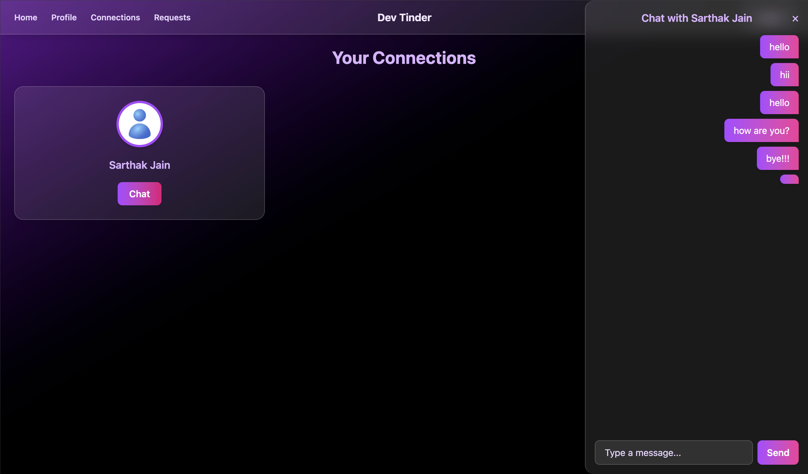
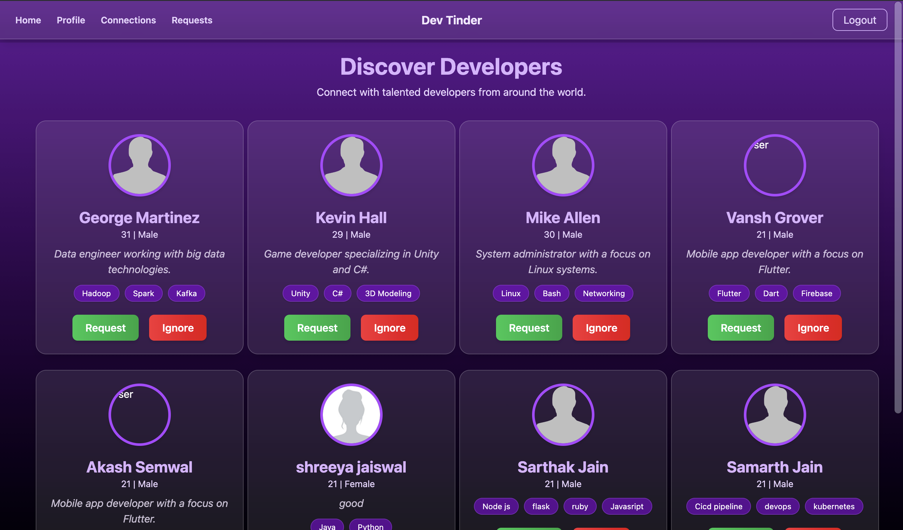
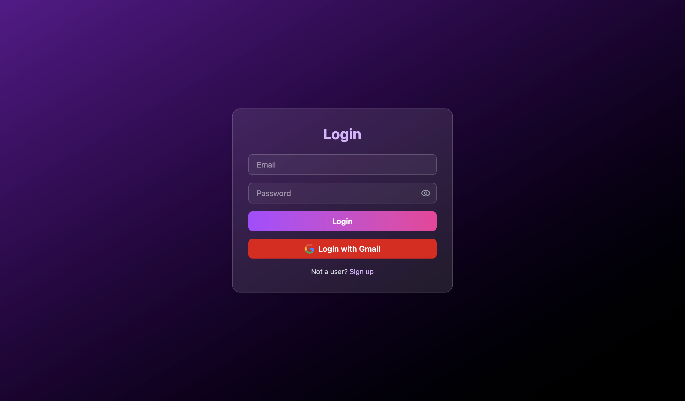

# Developer Matching Platform
An online platform that connects developers with similar interests and skill sets. Built with a React frontend and a Node.js + Express + MongoDB backend, it allows users to create profiles, browse matches, and chat in real time — all within a sleek, responsive interface.

## Screenshots
### Login window

*(Insert image here — e.g. )*

### 🧑‍💻 Dashboard / Feed  
*(Insert image here — e.g. )*

### 💬 Chat Window  
*(Insert image here — e.g. )*

# Features

- User authentication using JWT (JSON Web Tokens)
- Profile browsing and matching based on user skills and interests
- Real-time chat using Socket.IO
- RESTful API built with Express.js
- NoSQL database with MongoDB for users, connections, and messages
- Responsive UI with React and Tailwind CSS
- Conditional rendering and dashboard for personalized experience

# Tech Stack

- **Frontend**: React, Tailwind CSS  
- **Backend**: Node.js, Express.js  
- **Database**: MongoDB (Mongoose ORM)  
- **Authentication**: JWT (JSON Web Token)  
- **Real-time Communication**: Socket.IO  

## Installation and running
docker compose up
docker run

### Environment Variables
Create a `.env` file inside the Backend directory:

MONGO_URI=<your_mongodb_connection_string>
JWT_SECRET=<your_jwt_secret>
PORT=5000

# How it works

The Developer Matching Platform enables users to register, log in, browse other developers, send connection requests, and chat in real time once connected.

---

## Backend (Node.js + Express.js)

### **Authentication & User Management**
- **JWT-based Authentication**  
  Secure login, logout, and signup using JSON Web Tokens.
- **Google Authentication**  
  `/gmail-login` endpoint allows OAuth-based login through Gmail.

### **API Endpoints**

| **Endpoint** | **Method** | **Description** |
|---------------|------------|-----------------|
| `/sign-up` | POST | Register a new user |
| `/login` | POST | Authenticate a user and issue JWT |
| `/logout` | POST | Logout the user (invalidate token on frontend) |
| `/gmail-login` | POST | Login using Google OAuth |
| `/messages/:userId/:otherUserId` | GET / POST | Fetch or send chat messages |
| `/profile/view` | GET | View own profile |
| `/profile/edit` | PUT | Edit profile details |
| `/request/send/:status/:toUserId` | POST | Send connection request |
| `/request/recieve/:status/:fromUserId` | POST | Accept or reject a received request |
| `/requests/received` | GET | Get all pending connection requests |
| `/connections` | GET | Get list of connected developers |
| `/feed` | GET | Fetch list of suggested developers to connect with |

### **Database Models**
- **User**: Stores username, email, password hash, skills, bio, and profile picture.
- **Request**: Tracks connection requests between users with status (pending, accepted, rejected).
- **Message**: Stores chat messages, sender/receiver IDs, timestamps.
- **Connection**: Created upon mutual acceptance of requests.

### **Real-time Chat (Socket.IO)**
- Enables one-on-one messaging between connected users.
- Handles live updates for messages and connection status.
- Socket events: `message`, `newRequest`, `connectionUpdate`.

---

## Frontend (React + Tailwind CSS)

### **Folder Structure**

### **Component Overview**
- **Body.jsx** – Main container that wraps Feed, Connections, or ChatWindow.  
- **Card.jsx** – Displays developer details in feed view with action buttons (Connect/Ignore).  
- **ChatWindow.jsx** – Real-time chat UI using Socket.IO.  
- **Connections.jsx** – Lists connected developers and opens chat on selection.  
- **EditProfile.jsx** – Form for editing name, skills, and bio.  
- **Feed.jsx** – Displays discoverable developer profiles.  
- **Login.jsx** – Login form with JWT and Google login support.  
- **Navbar.jsx** – Navigation bar with quick links (Feed, Profile, Chat, Logout).  
- **Profile.jsx** – Displays user’s personal information and edit option.  
- **RequestsReceived.jsx** – Handles incoming connection requests.  
- **SignUp.jsx** – Signup form with validation and API integration.  
- **SocketManager.jsx** – Centralized Socket.IO connection and event handling.

---

---

# Acknowledgements
This project was developed as a part of full-stack web development practice.  
Thanks to the **React**, **Express**, **MongoDB**, and **Socket.IO** communities for their comprehensive documentation and examples.

# Licence
This project is for personal/educational use only.  
All rights reserved. Commercial use is prohibited.

